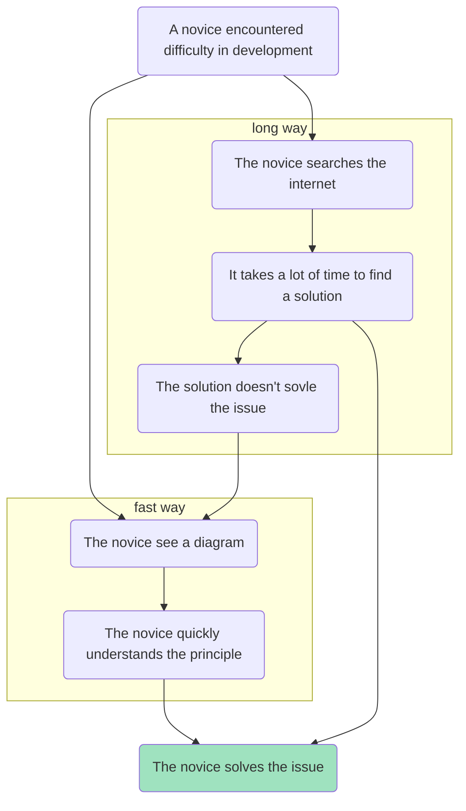

# learn-it-dev-with-diagrams
Learn IT development with diagrams.
Here you can find diagrammed instructions of various operations performed in order to develop IT applications.

These instructions are primarily intended for beginners. That is why I chose diagrams. They are of mermaid diagrams and look like this:

You are welcome to contribute by finding a question in the issues section you have answer to. You pull request and I'll merge.

# License
This source code is licensed under the Creative Commons Attribution-NonCommercial-NoDerivs license (CC BY-NC-ND). You are free to view, read and share the code with others as long as you credit the author and provide appropriate attribution. Any modifications or commercial use are not permitted under this license. All rights are reserved by the author.
