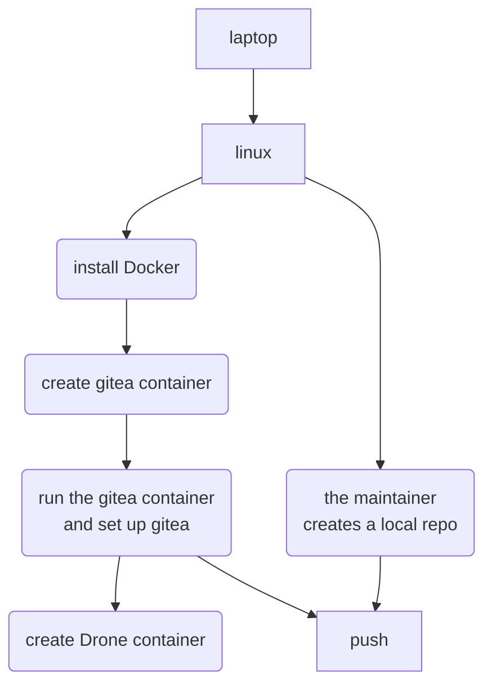

```mermaid
graph TD;
laptop-->linux-->docker --> gitea -->setup_gitea --> drone;
linux-->m_local_repo-->push
setup_gitea-->push


docker(install Docker);
gitea(create gitea container);
drone(create Drone container);
setup_gitea("run the gitea container
  and set up gitea");
m_local_repo("the maintainer
  creates a local repo");
```
