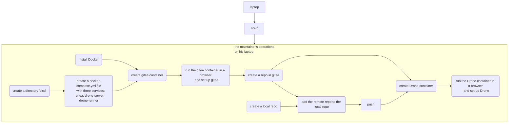

```mermaid
graph TD;
laptop-->linux-->maintainer;
subgraph maintainer["the maintainer's operations
    on his laptop"]
    docker --> gitea -->setup_gitea --> gitea_repo--> drone;
    cicd_directory-->compose--> gitea
    m_local_repo-->remote_repo-->push --> drone-->setup_drone
    gitea_repo-->remote_repo
    end


docker(install Docker);
gitea(create gitea container);
setup_gitea("run the gitea container in a browser
  and set up gitea");
gitea_repo("create a repo in gitea");
m_local_repo("create a local repo");
remote_repo("add the remote repo to the local repo");
cicd_directory("create a directory 'cicd'");
compose("create a docker-compose.yml file
    with three services:
    gitea, drone-server, drone-runner");
drone(create Drone container);
setup_drone("run the Drone container in a browser
  and set up Drone");
```
